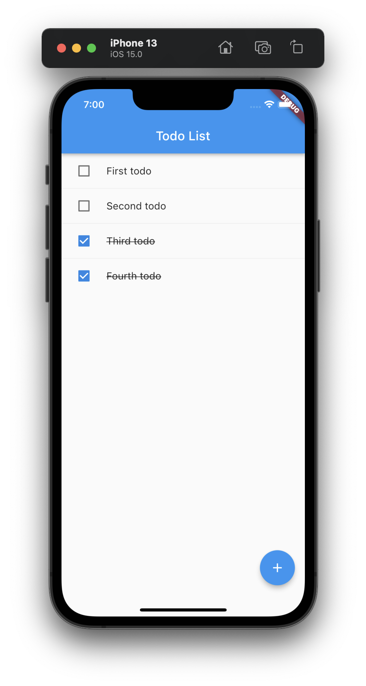

# Flutter Todo List



## Getting Started

Start the server

```
node server/app.js
```

Make it work on Android
```
adb reverse tcp:3000 tcp:3000
```

Run the app

```
flutter run
```

## Running tests

Generate mocks
```
flutter pub run build_runner build
```

Start the server

```
node server/app.js
```

Make it work on Android
```
adb reverse tcp:3000 tcp:3000
```

Run unit and widget tests
```
flutter test
```

Run integration tests
```
flutter test integration_test
```

## More Info

This project is a starting point for a Flutter application.

A few resources to get you started if this is your first Flutter project:

- [Lab: Write your first Flutter app](https://flutter.dev/docs/get-started/codelab)
- [Cookbook: Useful Flutter samples](https://flutter.dev/docs/cookbook)

For help getting started with Flutter, view our
[online documentation](https://flutter.dev/docs), which offers tutorials,
samples, guidance on mobile development, and a full API reference.
